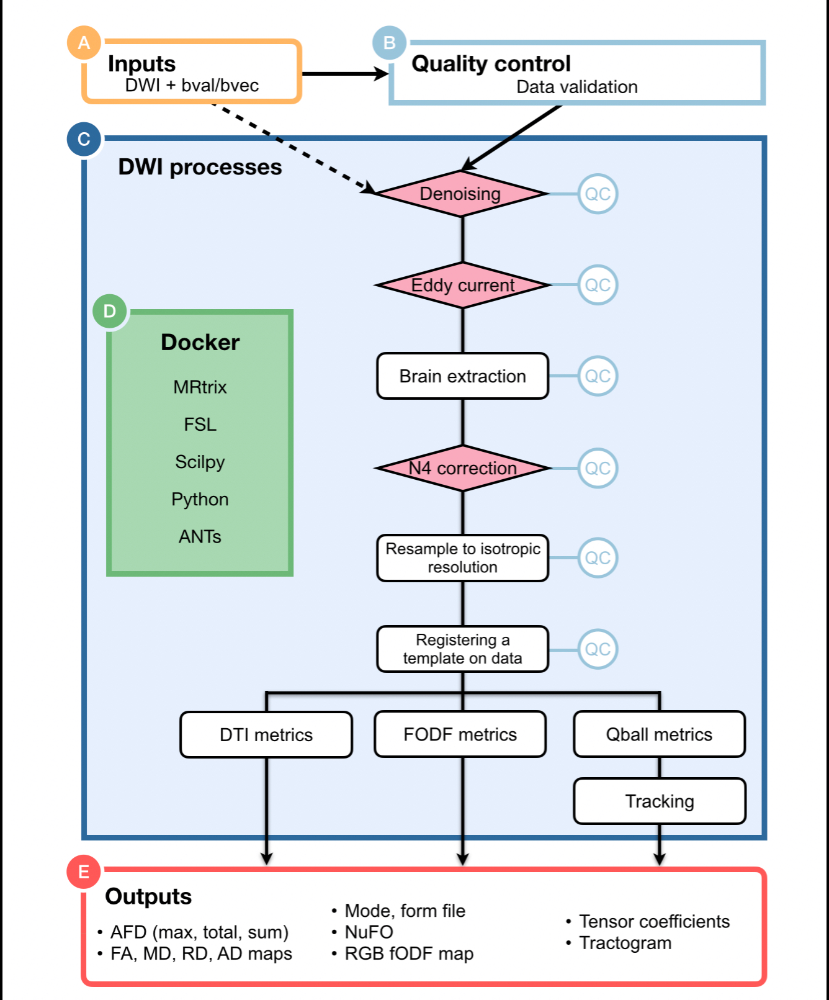

import CommandOutputs from '../../../components/CommandOutputs.astro';
import { Tabs, TabItem } from '@astrojs/starlight/components';
import { FileTree } from '@astrojs/starlight/components';
import { Steps, Aside } from '@astrojs/starlight/components';



## **Running the pipeline**

The typical command for running the pipeline locally is as follows:

<Tabs>
  <TabItem label="Command">
    ```bash
    nextflow run scilus/sf-tractomics -r <release_version> \
      --input <input_directory> \
      --outdir ./results \
      -profile docker,full_pipeline \
      -with-report <report_name>.html \
      -resume
    ```
  </TabItem>
</Tabs>

This will launch the pipeline with the `docker` and the `full_pipeline` configuration profiles, which automatically spawns docker containers when necessary and runs all the possible diffusion MRI processing steps respectively.

<Steps>
  1. **`--input`**: the path to your BIDS directory

     For more details on how to organize your input folder, please refer to the [inputs section](/sf-tractomics/guides/inputs).

  2. **`--outdir`**: path to the output directory

     We do not specify a default for the output directory location to ensure that users have total control on where the output files will be stored,
     as it can quickly grow into a large number of files. The recommended naming would be something along the line of `sf-tractomics-v{version}` where
     `{version}` could be `0.1.0` for example.

  3. **`-profile`**: profile(s) to be run and container system to use

     `sf-tractomics` processing steps was designed in profiles, giving users total control on which type of processing they want to make. One caveat is that users need to explicitly tell which profile to run. This is done via the `-profile` parameter.
     
     Multiple profiles can be specified at once by separating them with **only a comma and no whitespace** (important!). To choose the appropriate profile(s) for your needs, please see [this section](#choosing-a-profile).
   
      :::note
      Notice that the prefix of the `-profile` command line parameter contains only a **single dash**. Parameters specified with a single dash are `nextflow` core parameters.
      :::

  4. **`-with-report`**: Enables `nextflow` caching capabilities.

     This is a core `nextflow` argument. It enables the creation of a *html report* of the pipeline execution. This report includes some basic metrics about a pipeline run. For more details, see the [core `nextflow` arguments section](#core-nextflow-arguments).

  5. **`-resume`**: Enables `nextflow` caching capabilities.

     This is a core `nextflow` argument. It enables the *resumability* of your pipeline. In the event where the pipeline fails for a variety of reasons,
     the following run will start back where it left off. For more details, see the [core `nextflow` arguments section](#core-nextflow-arguments).
</Steps>


:::note
More parameters can be tuned to your own usage, for a concise list of the most common parameters, you can run `nextflow run scilus/sf-tractomics -r 0.1.0 --help`.
Otherwise, for the complete list of parameters, please refer to the [parameters section](/sf-tractomics/guides/parameters) of the documentation.
:::

Note that the pipeline will create the following files in your working directory:

<FileTree>
  * work/                           # Nextflow working directory
  * .nextflow\_log                  # Log file from Nextflow
  * sf-tractomics-v0.1.0/           # Results location (defined with --outdir)
    * pipeline_info                 # Global informations on the run
    * stats                         # Global statistics on the run
    * sub-01
      * ...                         # Other entities like session
        * anat/                     # Clean T1w in diffusion space
        * dwi/                      # All clean DWI files, models, tractograms, ...
          * bundles/                # Extracted bundles when using bundling
      * xfm/                        # Transforms between diffusion and anatomy
  * ...                             # Other nextflow related files
</FileTree>


## **Choosing a profile**

Some `sf-tractomics` core functionalities are accessed and selected using profiles and arguments.

<Aside type="caution">
   We highly recommend the use of Docker or Singularity containers (via the `docker` or `apptainer` profiles) for full pipeline reproducibility and ease of use, however when this is not possible, Conda is also supported.
</Aside>

<Aside type="tip" title="Using multiple profiles">
More than one profile can be used at the same time! For example, `-profile docker,gpu` will activate both running the processes in Docker containers it will also provide GPU access to those containers during the pipeline execution.
</Aside>

**Configuration profiles**:

<Steps>
  1. **`-profile docker` (Recommended)**:

     Each process will be run using Docker containers.

  2. **`-profile apptainer` (Recommended)**:

     Each process will be run using Apptainer images.

  3. **`-profile slurm`:**

     If selected, the SLURM job scheduler will be used to dispatch jobs. This is most commonly used when running pipelines on an HPC server.

     :::note
     When running with this profile and your compute nodes do not have internet access, we strongly recommend [installing the pipeline for offline use](/sf-tractomics/user_guides) if you haven't done so already.
     :::

  4. **`-profile arm`:**

     Made to be use on computers with an ARM architecture (e.g., Mac M-series chips). This is still **experimental** and some containers might not be built for the ARM architecture yet. Feel free to open an issue if needed.

</Steps>

**Processing profiles**:
<Steps>
   1. **`-profile gpu`**

      Activate usage of GPU accelerated algorithms to drastically increase processing speeds. Currently only
      supports CUDA (e.g. NVidia's GPU). Accelerations for **FSL Eddy** and **Local tractography** are automatically enabled
      using this profile. If you're encountering errors while using this profile, please refer to the [troubleshooting page](/sf-tractomics/user_guides/troubleshooting).

   2. **`-profile full_pipeline`**

      Runs the full **sf-tractomics** pipeline from end-to-end, with all processing steps enabled.
</Steps>

**Using either `-profile docker` or `-profile apptainer` is highly recommended, as it controls the version of the software used and ensure reproducibility.** While it is technically possible to run the pipeline without Docker or Apptainer, the amount of dependencies to install is simply not worth it.


## **Core `nextflow` arguments**

:::note
These options are part of Nextflow and use a *single* hyphen (pipeline parameters use a double-hyphen).
:::

### **`-profile`**

Use this parameter to choose a configuration profile. Profiles can give configuration presets for different compute environments.

Several generic profiles are bundled with the pipeline which instruct the pipeline to use software packaged using different methods (Docker, Singularity, and Apptainer) - see below.

The pipeline also dynamically loads configurations from [https://github.com/nf-core/configs](https://github.com/nf-core/configs) when it runs, making multiple config profiles for various institutional clusters available at run time. For more information and to check if your system is supported, please see the [nf-core/configs documentation](https://github.com/nf-core/configs#documentation).

Note that multiple profiles can be loaded, for example: `-profile tracking,docker` - the order of arguments is important!
They are loaded in sequence, so later profiles can overwrite earlier profiles. For a complete description of the available profiles, please see this
[section](#choosing-a-profile).

### **`-resume`**

Specify this when restarting a pipeline. Nextflow will use cached results from any pipeline steps where the inputs are the same, continuing from where it got to previously. For input to be considered the same, not only the names must be identical but the files' contents as well. For more info about this parameter, see [this blog post](https://www.nextflow.io/blog/2019/demystifying-nextflow-resume.html).

You can also supply a run name to resume a specific run: `-resume [run-name]`. Use the `nextflow log` command to show previous run names.

### **`-with-report`**
Nextflow can create an HTML execution report: a single document which includes many useful metrics about a workflow execution. The report is organised in the three main sections: Summary, Resources and Tasks.

### **`-params-file`**

Instead of specifying all your pipeline parameters one by one each time in the command line when running the pipeline, you can specify your parameters in a single configuration file. Note that this doesn't work for nextflow core arguments (with single hyphens). The parameters file can either be a YAML or JSON. For example:

<Tabs>
  <TabItem label="YAML">
    ```yaml title="params.yaml"
    input: '<input_directory>/'
    outdir: './results/'
    <...>
    ```

    And running the pipeline with:
    ```bash
    nextflow run scilus/sf-tractomics -r <release_version> -params-file params.yaml [...]
    ```
  </TabItem>
  <TabItem label="JSON">
    ```json title="params.json"
    {
      "input": "<input_directory>/",
      "outdir": "./results/",
      <...>
    }
    ```

    And running the pipeline with:

    ```bash
    nextflow run scilus/sf-tractomics -r <release_version> -params-file params.json [...]
    ```
  </TabItem>
</Tabs>

### **`-c`**

This specifies a path to a `nextflow configuration file`. This file differs from the previous `-params-file` argument since this allows to [tune process resource specifications](https://nf-co.re/docs/usage/configuration#tuning-workflow-resources), other infrastructural tweaks (such as output directories and published files) or module arguments (args). Beware that this way of customizing the pipeline's execution might require a more in-depth knowledge of the pipeline and it is very error-prone. The following example simply illustrates how to structure such a configuration:

```groovy title="nextflow.config"
process {
    withName: ".*:ENSEMBLE_TRACKING" {
        memory = 16.GB
        ext.suffix = "ensemble_tracking"
        publishDir = false
    }
}
```
And running the pipeline with:

```bash
nextflow run scilus/sf-tractomics -r <release_version> -c nextflow.config [...]
```

<Aside type="caution">
   Note that we discourage the use of the `-c` argument **to specify parameters for the pipeline**. Although possible to parametrize the pipeline this way, it can lead to unexpected errors. We suggest using the `-params-file` above when possible. See the [nf-core website documentation](https://nf-co.re/usage/configuration) for more information.
</Aside>

## **Reproducibility**

We recommend tagging the appropriate version when running the pipeline on your data. This ensures that a specific version of the pipeline code and software are used when you run your pipeline. If you keep using the same tag, you'll be running the same version of the pipeline, even if there have been changes to the codebase since.

First, go to the [scilus/sf-tractomics releases page](https://github.com/scilus/sf-tractomics/releases) and find the latest pipeline version - numeric only for a stable release (e.g. `0.1.0`). Then specify this when running the pipeline with `-r` (one hyphen) - eg. `-r 0.1.0`. Of course, you can switch to another version by changing the number after the `-r` flag.

This version number will be logged in reports when you run the pipeline, so that you'll know what you used when you look back in the future. For example, this version will be logged at the bottom of the final MultiQC reports.

To further assist in reproducibility, you can use share and reuse [parameter files](#using-the-paramsyml-file) to repeat pipeline runs with the same settings without having to write out a command with every single parameter.
